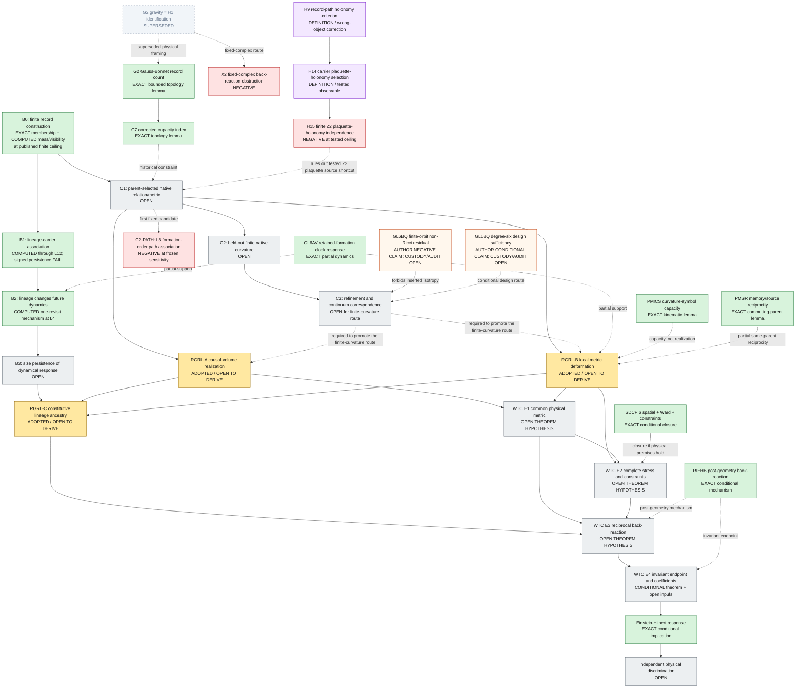

# Foundational dependency DAG

**Status:** initial critical-path map, 2026-09-25
**Authority:** audit aid only; source theorems and their seals remain controlling.

## Reading rule

A solid arrow means “is required to support,” not “has already proved.” A
dashed arrow marks partial support, a route-specific condition, or a historical
constraint rather than a universal prerequisite. A green node is established
at its stated ceiling; amber is an adopted premise; blue is an active computed
lane; red is an audited negative result; orange has unresolved custody/audit;
gray is open; and a gray dashed border is superseded. The graph therefore makes
the central gap visible instead of allowing an exact conditional conclusion to
hide an unproved antecedent.



## Current adjudication

The repository contains more foundational work than the finite Zenodo capsule
shows. That work is scientifically relevant because it includes exact bounded
lemmas and failed routes, not only successful constructions. It does not,
however, erase the main logical gap:

```text
established finite record results
    != derived record-conditioned spacetime

(RGRL + WTC hypotheses) -> Einstein-Hilbert response
    != microscopic dynamics -> RGRL + WTC hypotheses
```

The premise-discharge program is therefore not a request to discard the
framework. It is a request to prove or falsify the arrows that the current
working theory explicitly adopted.

## Premise-discharge status

The source audit finds that none of D1--D3 or E1--E4 is fully discharged under
the program's evidence rule.

| Gate | Existing evidence | Decisive missing step | Status |
|---|---|---|---|
| D1 causal volume | RFCD exact finite `1+1` order; TROV operational preorder; same-parent projective causal-measure theorem; exact fixed-finite-ray obstruction | Parent-selected probe-complete `3+1` chronology, manifold/refinement, common probes, and independently calibrated four-volume | `OPEN` |
| D2 local deformation | PMICS curvature-symbol capacity; PMSR finite commuting reciprocity; GL6T finite lineage-gated response; separate charge, energy, and recoil pieces | One same parent with physical metric solder, complete local stress/source, temporal/current/contact operators, off-shell Ward packet, gluing, and common cone | `OPEN` |
| D3 lineage ancestry | FPMH matched finite KEEP/BREAK custody and GL6T forward response | Reconstructed geometry that prospectively follows lineage under a complete collateral ledger; the tested old-support reciprocal route is exactly zero in GL6BC | `OPEN` |
| E1 common metric | Conditional optical/clock/probe lemmas recorded in the emergence register | Same physical proper-time, transport, principal, and variational metric across matter, EM, records, clocks, and independent probes | `OPEN` |
| E2 stress/constraints | SDCP exact implication plus partial finite charge/energy/recoil results | Complete same-parent stress, contacts, ports, Ward identity, initial constraints, and propagation | `OPEN` |
| E3 reciprocal loop | RIEHB conditional macroscopic loop and finite upward-response pieces | One genealogy generated from records through metric/stress and back into every future sector | `OPEN` |
| E4 endpoint/coefficients | RIEC/RIEHB/WTC exact conditional Einstein-Hilbert classification | Physical antecedents, extra-channel exclusion, controlled corrections, microscopic or empirical coefficient custody; `G` is presently calibrated and `Lambda` remains free | `OPEN` |

The exact source anchors and evidence classes for these rows are in
`FOUNDATIONAL_CLAIM_LEDGER.tsv`. Register-only entries whose source lanes are
absent from this checkout are not treated as reverified theorem evidence.

## Existing results that constrain the next work

- **G2 is not a physical derivation.** Its exact Gauss-Bonnet identity survives
  as a bounded closed-surface corollary, while its definitional identification
  was superseded. G7 supplies the corrected Euler--Poincare capacity index and
  displays why unrestricted `2-chi` fails on a disk.
- **X2 and H15 matter.** They rule out two bounded shortcuts: internal
  back-reaction on the tested fixed complex and direct sourcing of the tested
  finite Z2 plaquette holonomy by record content. H15 is not a universal
  holonomy no-go.
- **GL6AV matters.** It provides genuine same-parent record dependence of a
  leading collective interaction, but its own theorem excludes a complete
  physical metric interpretation.
- **PMICS matters.** It proves that the candidate six-component pair-memory
  tangent has the correct local intrinsic-curvature quotient. It does not
  derive the physical tangent or its dynamics.
- **PMSR matters.** It proves a finite commuting-parent mixed-derivative
  reciprocity between observable pair memory and a physical-source response.
  It does not transport that result through the complete noncommuting F3
  parent.
- **SDCP and RIEHB matter.** They sharply reduce the macroscopic task once a
  common physical metric, complete source/Ward packet, initial constraints,
  coefficient sign, and tangent span have been earned. Their exactness is
  conditional on those physical inputs; it does not earn them.
- **GL6BQ may matter after custody is repaired.** Its author theorem says the
  authenticated finite orientation orbit leaves a non-Ricci residual and
  separately proves sufficiency of a hypothetical degree-six design. Missing
  manifest-listed packet files and the absent distinct hostile audit prevent
  either result from being promoted as independently verified here.
- **RGRL and WTC remain visible as assumptions.** Their conditional theorem is
  exact, but its physical antecedents remain the critical path.

## Immediate executable order

1. Finish the historical claim ledger and package crosswalk while preserving
   the completed finite calculations and their negative outcomes.
2. Retain the reconciled L10/L12 result as resolved finite association plus a
   failed signed persistence prediction; do not convert either into an all-size
   claim.
3. Retain the independently reproduced L4 first-revisit response as a mechanism
   result and design any B3 scale test prospectively.
4. Re-adjudicate the native relational-object question after the controlled L8
   formation-order-path null. Do not choose a richer graph after seeing that
   null without a new prospective derivation and freeze. This diagnostic branch
   need not block logically independent causal-volume or physical-deformation work.
5. Treat finite curvature as a finite test until a refinement theorem earns a
   continuum object; require that refinement only for routes that use the
   finite curvature object as a continuum antecedent.
6. Work through RGRL-A/B/C and WTC E1-E4 as explicit proof obligations. RGRL-C
   requires both a lineage intervention and an earned reconstructed geometry;
   E2 requires the common physical metric as well as the source/Ward packet.
   Keep negative outcomes in the same ledger.
